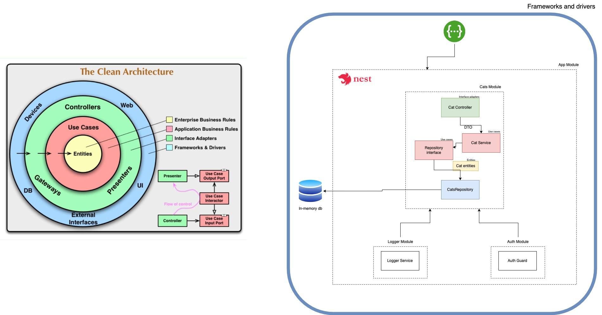

<p align="center">
  <a href="http://nestjs.com/" target="blank"></a>
</p>

[circleci-image]: https://img.shields.io/circleci/build/github/nestjs/nest/master?token=abc123def456
[circleci-url]: https://circleci.com/gh/nestjs/nest

  <p align="center">Generated using <a href="https://github.com/nestjs/nest" target="_blank">Nest</a>, a progressive <a href="http://nodejs.org" target="_blank">Node.js</a> framework for building efficient and scalable server-side applications.</p>
    <p align="center">
<a href="https://www.npmjs.com/~nestjscore" target="_blank"></a>
<a href="https://www.npmjs.com/~nestjscore" target="_blank"></a>
<a href="https://www.npmjs.com/~nestjscore" target="_blank"></a>
<a href="https://circleci.com/gh/nestjs/nest" target="_blank"></a>
<a href="https://coveralls.io/github/nestjs/nest?branch=master" target="_blank"></a>
<a href="https://discord.gg/G7Qnnhy" target="_blank"></a>
<a href="https://opencollective.com/nest#backer" target="_blank"></a>
<a href="https://opencollective.com/nest#sponsor" target="_blank"></a>
  <a href="https://paypal.me/kamilmysliwiec" target="_blank"></a>
    <a href="https://opencollective.com/nest#sponsor"  target="_blank"></a>
  <a href="https://twitter.com/nestframework" target="_blank"></a>
</p>
  <!--[](https://opencollective.com/nest#backer)
  [](https://opencollective.com/nest#sponsor)-->

## Description

The implementation is striving to achieve the Clean Architecture (CA) according to Uncle Bob's system architecture proposal.


The application is divided into 4 main layers:

1. **Entities** - These are represented by the Cat interface and define the essential attributes and structures of the core business logic entity.

2. **Use Cases** - This is the Service layer where the actual implementation of business logic resides. It also provides an interface to the Repository, allowing for the decoupling and inversion of dependencies, following the principles of Dependency Inversion.

3. **Interface Adapters** - This represents the Controller layer, responsible for receiving and processing input. It validates and transforms the data as needed, calls the relevant use cases (service methods), and returns responses to the calling components.

4. **Frameworks and Drivers** - This layer holds external dependencies, such as in-memory databases and Swagger documentation. It also includes the CatsRepository class, which implements the database handling functionality.

Through the utilization of NestJS boilerplate, our application is already separated into well-defined layers, similar to the CA approach. We further embrace the concept of Inversion of Control (IoC) and use Dependency Injection (DI) to delegate control to the framework. This empowers us to dynamically determine and specify which class dependencies to use during runtime, resulting in loose coupling, improved reusability, and effortless maintainability.

## Installation

```bash
$ yarn install
```

## Running the app

```bash
# development
$ yarn run start

# watch mode
$ yarn run start:dev

# production mode
$ yarn run start:prod
```

## Test

```bash
$ yarn run test
```
